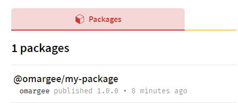
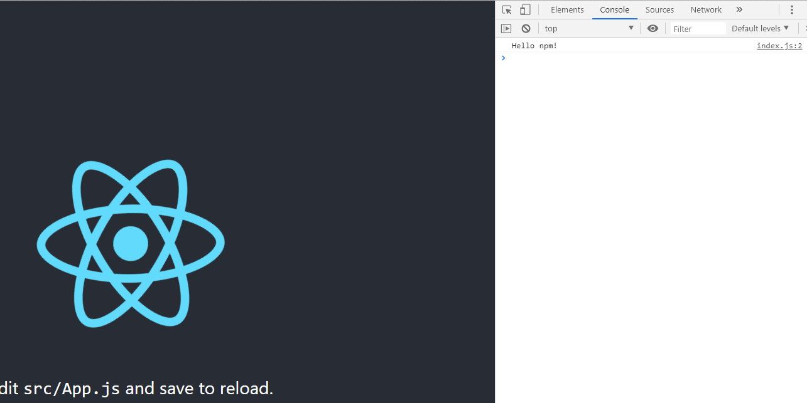

# Publish Your Own NPM Package

This project shows you how to create a simple package and publishing it on the npm registry.

## Table of Contents
  - [Prerequisites](#prerequisites)
  - [Steps](#steps)
    - [Setting up our npm account](#Setting-up-our-npm-account)
    - [package.json](#packagejson)
    - [index.js](#indexjs)
  - [Using our package](#using-our-package)
  - [Testing our package](#testing-our-package)
  - [Disclaimer](#disclaimer)
  - [Author](#author)
  - [Acknowledgments](#acknowledgments)

[//]: **[repo](https://github.com/Omar-Gee/publishing-to-npm-example)**

## Prerequisites

 * [NodeJS](https://nodejs.org)
 * [An npm account](https://www.npmjs.com/)
 * Any editor of choice

## Steps
### Setting up our npm account
If you don't already own an npm account, please do that [now](https://www.npmjs.com/).

Now that you have your account, lets sign in using the npm cli:

`npm login`

You will be prompted to enter your username, password and the email address that you used to create the account.

If everything goes well you will see,

`Logged in as <your_username> on https://registry.npmjs.org/.`

Good stuff!

Next we focus on the package we want to publish.

```
mkdir my-package-directory
cd my-package-directory
```
Open the directory in your favorite text editor.

Any package that wants to be added to the registry needs to have at least a package.json and an entry point. In this example, index.js.

### [package.json](https://docs.npmjs.com/files/package.json)
You can either run `npm init` and let npm generate a package.json file for you or you can create a new **package.json** file in the root of your directory.

Make sure to add/edit these key-value pairs to your liking

```
{
  "name":"my-package",
  "version": "1.0.0",
  "main": "index.js"
}
```

* name - required
* version - required
* main

> The main field is a module ID that is the primary entry point to your program. That is, if your package is named foo,
> and a user  installs it, and then does require("foo"), then your main module’s exports object will be returned.
> <cite>[Further reading](https://docs.npmjs.com/files/package.json)</cite>

### index.js
For this example we will be exporting a simple function that logs

> Hello npm!

to the devtools console.

```
export default function hello() {
  console.log("Hello npm!");
}
```

Now that we have our necessary files set up, we can go ahead and start publishing our package.

In your terminal, run

`npm publish`

This will most likely result in the following error

> You do not have permission to publish "my-package". Are you logged in as the correct user?

This would probably be because a package with that name already exists. Luckily for us npm [_scoping_](https://docs.npmjs.com/about-scopes) is a thing.

Lets edit our package name to the following
```
{
  "name":"@<your_username>/my-package",
  "version": "1.0.0",
  "main": "index.js"
}
```
Running `npm publish` again will yield the following error

>You must sign up for private packages

Private packages are part of npm's paid plan and thus we need to tell npm that this is going to be a public package.
Run npm publish again, but this time with the _--access_ flag set to  _public_

`npm publish --access public`

Finally! After some npm notices we get to see

`+ @<your_username>/my-package@1.0.0`

An email is sent to the address we used to sign up for the npm account. If we log into our account and navigate to packages we see our package.



## Using our package
To simulate a real project we'll be using a React project to install our package in. For this example we will use create-react-app as a base project.

In another directory run

`npx create-react-app my-package-tester`

then

`cd my-package-tester`

Now we can finally add our package to our "project" and use it.

`npm i <your_package_name>`

in my case

`npm i @omargee/my-package`.

You should see the package added to the project.

`+ @omargee/my-package@1.0.0`

You can also verify this by going to your node modules and seeing that your package is in there.

Only thing left to do is importing and using it. In our App.js file:

`import myHelloFunction from "@omargee/my-package"`

And in the App function we call our imported function:

`myHelloFunction()`

Finally, run

`npm start`

And there we go, our hello function, installed in our project, working as intended and visible in the devtools.




## Testing our package
Congratulations if you got this far!

Of course we would want to test our package before publishing it. It's the logical way of working.

For this, we can use [npm link](https://docs.npmjs.com/cli/link).

in our package directory run `npm link`.

In the project you want to test the package in, run

 `npm link <package_name>`

Once everything is working as intended you can publish your package with

`npm publish <package_name> --access public`

## Disclaimer
This is my first ever educational piece. If you have any comments or tips please let me know.

## Author

* [@og_fresh_pots](https://twitter.com/og_fresh_pots) - [github](https://github.com/Omar-Gee)

## Acknowledgments

This is a Palmera Bit. Part of the new series _Palmera Bits_ from the guys over at [Palmera Bytes](https://palmerabytes.com/).